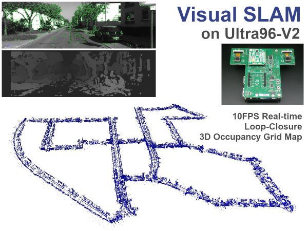

# U96-SLAM
Visual SLAM on Ultra96-V2

## About
U96-SLAM is an implementation of stereo-vision-based SLAM on Ultra96-V2.
This repository contains all design files for this project.

## Article
The article is published in Hackster web site that describes how to build the project in detail.

Hackster 

## License
The design files contained in the "src" directory are distributed under the following licenses.

	src
	 ├─slam
	 │  └─src/include
	 │     ├─core     ┄┄ MIT
	 │     ├─octomap  ┄┄ New BSD
	 │     ├─flann    ┄┄ BSD
	 │     ├─rtabmap  ┄┄ BSD
	 │     └─opencv   ┄┄ New BSD
	 ├─StreoBM        ┄┄ MIT
	 ├─dvp            ┄┄ MIT
	 ├─capture_video  ┄┄ MIT
	 └─stereo_calib   ┄┄ MIT
